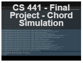
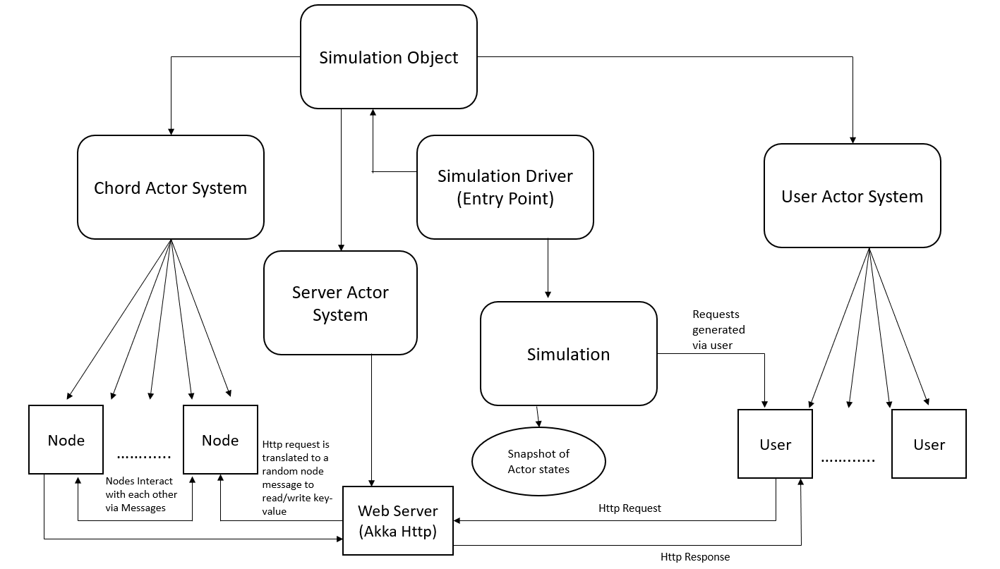

## UIC CS441 - Engineering Distributed Objects for Cloud Computing

## Course Project - Implement Chord, a cloud overlay network algorithm with consistent hashing using Akka/HTTP-based simulator.

## Overview

In this project we aim to design, build and analyze the implementation of [CHORD algorithm ](https://pdos.csail.mit.edu/papers/ton:chord/paper-ton.pdf) using Akka framework to simulate a distributed hash table with a virtual overlay network for distribution of work in a cloud data center.

### What is CHORD?

Chord is a protocol and algorithm for a implementing peer-to-peer distributed hash table. A distributed hash table stores key-value pairs by assigning keys to different nodes and each of those nodes will store the values for which it is responsible. Chord algorithm specifies how keys are assigned to the nodes and how the nodes interact with each other to find and store the key in the node responsible for that data.

### What is Akka, Actor and Akka-Http?

Akka is a framework for building concurrent, distributed and resilient message driven applications.

In this project we extensively use Akka Actor Model. An actor is a container for state and behavior encapsulated behind an Actor Reference. Actors can only communicate by exchanging messages.

The Akka HTTP modules implement a full server- and client-side HTTP stack on top of akka-actor and akka-stream.

## Team Members

- Lachezar Lyubenov (llyube2@uic.edu)
- Mehul Birari (mbirar2@uic.edu)
- Pramodh Acharya (pachar7@uic.edu)


### Video demo of the Simulation

[](https://www.youtube.com/watch?v=gado6wjvBYw "Demo of the project")

## Instructions to run the Simulation

### Prerequisites

- Your workstation should have [SBT](https://www.scala-sbt.org/) installed.
- Your workstation should have [Docker](https://hub.docker.com/) installed.

#### Steps to execute this project via Docker Image

Docker image for executing this project is at 
[Chord Simulation Docker Image](https://hub.docker.com/r/llyube2/chord)

Execute the following commands in your terminal.

```
docker pull llyube2/chord
docker run -i -t llyube2/chord /bin/bash
```

### Steps to run the project via SBT shell

- Clone this private repository.
- Open the sbt shell and navigate to the path as the local repository's path.

#### Compile and Test
- Type the following command in the sbt shell in order to build the project and run unit tests.

```
sbt clean compile test
```

#### Run Simulation

- Type the following command in the sbt shell to run the simulation.

```
sbt run
```

NOTE : Once the Simulation has started, you can hit the web server using your browser/postman or any other means. The server is hosted on the localhost. You can do a GET request and fetch the year a movie was released in if it is present in our data set. If not you will get a 'not found' response.

- Read URL Example

`http://localhost:8080/chord?title=MyOwnMovie`


## Architecture of CHORD SImulator 



### Main Components of the application

1. Simulation Driver:

    This is the entry point to the Simulation Program. A Simulation Object is created which encompasses the below functionality.
    - Creates all the Nodes in the Chord system.
    - All the users for the user system are generated.
    - The web service is created and the GET and PUT endpoints of our simulation is exposed as web services.
    - The data to simulate is fetched from the Movie database.
    - After the initial setup, the simulation starts and runs for a given input time capturing the states of the nodes and users at a given time based on input.

2. Node (Actor)

    Every node in our Chord is an actor and each actor has a number of behaviors (how they compute each message). Each node also ned to maintain its state which keeps changing continuously.
    The different states and behaviors of a node are:

    - Each node is created with it's state variables like successor, predecessor and all the node references in the finger table referring to itself. It also maintains states like number of hops via the node, write requests and read requests the node has served.

    - `Join` : With the help of an existing node a new node is able to find its location based on the hash value generated for the joining node. This is accomplished by the `FindNodePosition` behavior of the the node. It is also able to find its successor and predecessor nodes as a result.

    - `FindFingerNode` : This behavior helps in finding the finger nodes of the new joining node. Each node will be linked with m nodes in the finger table (where m is the number of bits used for hashing and generating the identifiers in the chord system. It can contain 2^m total nodes/unique keys)

    - `UpdateFingerTables` : The newly joined node after connecting with it's successor, predecessor and the Finger table nodes, notifies all the other nodes to change their Finger tables to accommodate the new node.

    - `UpdateData` : This behavior is to update data reference from the new node's successor to itself only of which range it is responsible for.

    - `FindKeyNode` : This is similar to `FindNodePosition` in the sense that the input key is hashed and the node responsible for that is located by an interactive communication with the actors. This is implemented using the `ask` pattern. A randomized node gets the input request and determines if it or it's successor are the node's responsible for maintaining it. If not then routes the request to the closest preceding finger to the key's hash value the node is connected with. This continues till the node responsible is found (If there is continuous routing the request times out) and if they key-value is available (`GetValueFromNode` behavior is used to find it), then the value is returned down the chain and the user gets the response.

    - `WriteKeyFindNode` : This is similar to reading a key. The same process is done but instead of reading once the node responsible for the hashed value of the key is found, the key-value pair is stored in that node using the `WriteKeyToNode` behavior.

3.  User (Actor)

    Impersonates a user who queries a database hosted in a data center. Its has state variables like read and write requests made. It also has the behavior of making read/write requests to the Akka based Web service.

4. Web Server 

    It is a simple Actor system built using Akka Http Server module. It is an abstraction over the `FindKeyNode` and `WriteKeyFindNode` behavior of the nodes. It routes the requests by the users to the nodes and the response from the nodes to the users.

### The Simulation

The simulation starts once the chord system is setup and the web server is started. The simulation runs for a given input number of minutes (From the ChordSimulator.conf file in src/main/resources). This simulation time is split into sub times of 1 minute each where a specific number of requests is generated from the given input range of request per minute. The read/write requests are then ade to the server via the user actors.
Time marks are input indicating at which time of the simulation a snapshot o the actor states is to be captured. Snapshots of the actor and node states are captured at given input time marks. A mandatory snapshot of all the states along with the node data like finger tables and the data size it contains is captured after the simulation ends and written as a JSON output. Once the simulation ends All the actor systems are terminated.

### Chord Algorithm

#### Chord Protocol
  - First we assign each present node and its key an m-bit identifier using SHA-1:
  
    - node: hash the node ID.
    - key: hash the key.

  - Identifiers are ordered in a virtual circle module 2^m, the Chord ring:
  
    - a ring of numbers from 0 to 2^(m-1).
  
#### Assigning keys to nodes
  - Assigning key k to a node:
  
    - first node whose identifier is equal to or follows the identifier of key k in the identifier space
    - successor node of k: successor(k)
    - first node clockwise from k on Chord ring
 
#### Minimal disruption
  - Minimal disruption when node joins/leaves
  - n joins:
	
	- certain keys assigned to successor(n) are now assigned to n
  
  - n leaves:
	
	- all keys assigned to n are now assigned to successor(n)
	
#### Lookup
  - Each node needs to know its successor on Chord ring
  - Query for identifier id is passed around Chord ring until successor(id) is found
  - Result returned along reverse path

#### Finger Table
  - Chord maintains additional routing info:
  
	- not essential for correctness
	- but allows acceleration of lookups
  
  - Each node maintains finger table with m entries:
	
	- n.finger(i) = successor(n + 2^i)
	
#### Applications of Chord 
  - Chord File System (CFS): 
	- Chord locates storage blocks
	
  - Distributed Indexes:
    - solves Napster's central server issue
	
  - Large-scale combinatorial search:
	- candidate solutions are keys, Chord maps these to machines which test them
	
  - Cooperative mirroring:
    - Uses Chord to provide load balancing
	
  - Time-shared storage:
    - Uses Chord to provide availability

### Analysis

- Refer to the document in ***`analysis`*** directory.

### Limitations

- Cannot handle Node failures or Nodes leaving a system.
- The concurrency during joining of a Node to they system has ask pattern implemented to figure out the Successor, Predecessor and it's Fingers. This increases latency of a Node joining the system

### Improvements

- Node behavior's of leaving the system/Failure of the node should be implemented as it is a real world scenario. This will involve implementing stabilization concept explained in the CHORD paper publication.